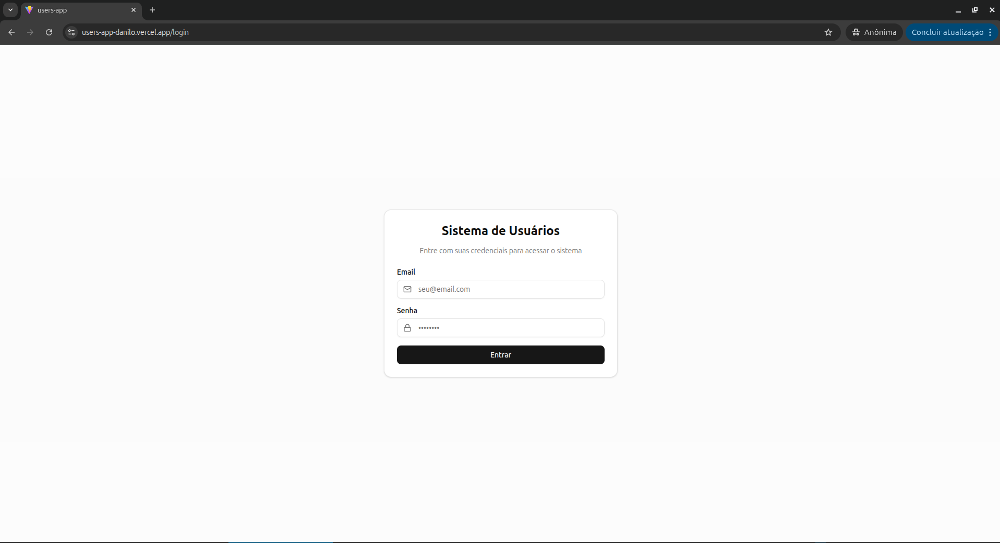
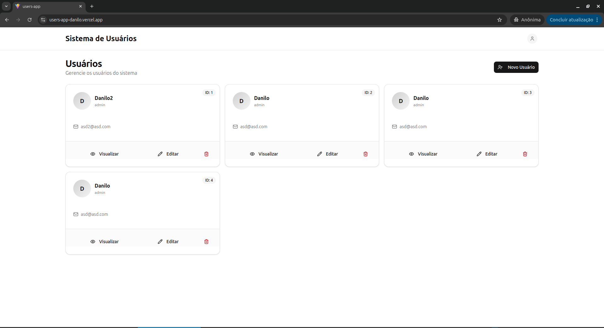
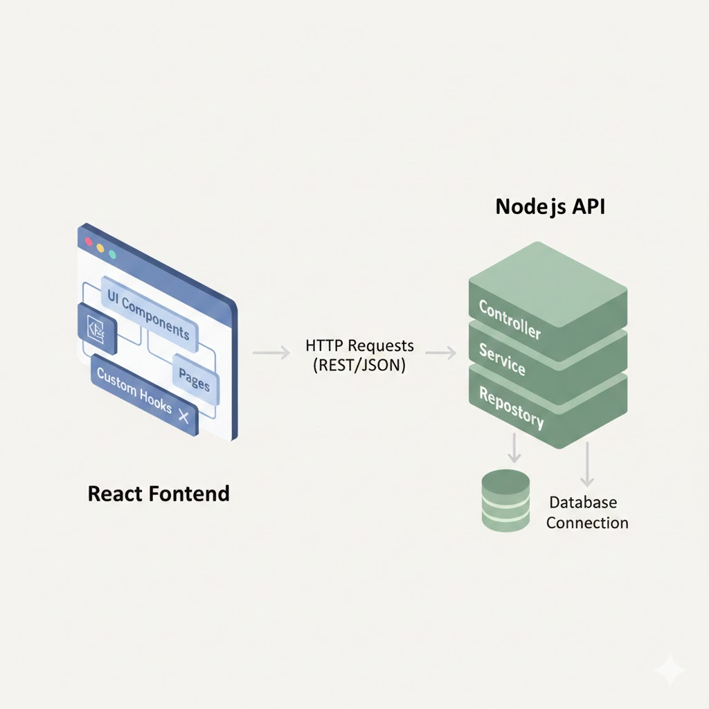

# users-app

Bem-vindo ao **users-app**!

Desenvolvida com **React**, **Vite** e **TypeScript**, oferece uma experiência rápida, segura e intuitiva, com autenticação, rotas protegidas, interface responsiva e integração com API REST

Principais recursos:

- Cadastro, edição e exclusão de usuários
- Autenticação com token JWT
- Interface amigável
- Rotas protegidas para segurança
- Deploy automático na Vercel

> **Acesse a aplicação online:**
>
> <p>
>   <a href="https://users-app-danilo.vercel.app/" target="_blank" style="font-size:1.2em;font-weight:bold;">🚀 https://users-app-danilo.vercel.app/</a>
> </p>

## Screenshots

<div style="display: flex; gap: 16px; align-items: flex-start;">
  <div style="flex: 1; text-align: center;">
    
    <p><strong>Tela de Login</strong></p>
  </div>
  <div style="flex: 1; text-align: center;">
    
    <p><strong>Lista de Usuários</strong></p>
  </div>
</div>

## Arquitetura

<div>
  
  <p><strong>Arquitetura do Projeto</strong></p>
</div>

## Estrutura de Pastas

- `src/app/` — Componentes principais da aplicação.
- `src/components/` — Componentes reutilizáveis (ex: Header, ProtectedRoute, UI components).
- `src/config/` — Configurações globais (ex: http.ts para configuração do axios ou fetch).
- `src/hooks/` — Custom hooks para lógica de autenticação, CRUD de usuários, etc.
- `src/layout/` — Layouts principais da aplicação.
- `src/lib/` — Funções utilitárias.
- `src/pages/` — Páginas principais (Login, UserList, UserEdit, UserNew, NotFound).
- `src/routes/` — Definição das rotas da aplicação.
- `src/service/` — Serviços para comunicação com a API (ex: AuthService, UserServices).
- `src/types/` — Tipagens TypeScript (ex: user.ts).

## Principais Arquivos e Funcionalidades

- **Rotas (`src/routes/index.tsx`)**: Utiliza `react-router-dom` para definir rotas protegidas e públicas, com componentes como `ProtectedRoute` e `RootLayout`.
- **Serviços (`src/service/`)**:
  - `AuthService.ts`: Login de usuário via API.
  - `UserServices.ts`: CRUD de usuários (listar, buscar detalhes, criar, editar, deletar).
- **Hooks (`src/hooks/`)**:
  - `useAuth.ts`: Gerencia autenticação e token no localStorage.
  - `useFetchUsers.ts`: Busca e armazena lista de usuários.
  - Outros hooks para criar, editar e deletar usuários.
- **Componentes de UI (`src/components/ui/`)**: Botões, inputs, cards, alertas, etc.

## Observações Importantes

- **Autenticação**: Utiliza token JWT salvo no localStorage. O hook `useAuth` centraliza login/logout.
- **Rotas protegidas**: O componente `ProtectedRoute` garante que apenas usuários autenticados acessem rotas restritas.
- **Consumo de API**: Todos os serviços usam um arquivo de configuração HTTP centralizado (`src/config/http.ts`).
- **Tipagem**: O projeto é fortemente tipado com TypeScript, especialmente para entidades como `User`.

## Como rodar o projeto localmente

1. Clone o repositório:

```bash
git clone https://github.com/daniloaugusto9101/users-app.git
cd users-app
```

2. Instale as dependências (na raiz do projeto):

```bash
npm install
```

3. Rode o projeto (na raiz do projeto):

```bash
npm run dev
```

> **Importante:** Para que a comunicação funcione corretamente, a API também precisa estar rodando localmente. Certifique-se de iniciar o backend antes de acessar o frontend.

> Repositório da API: [https://github.com/daniloaugusto9101/users-api](https://github.com/daniloaugusto9101/users-api)
